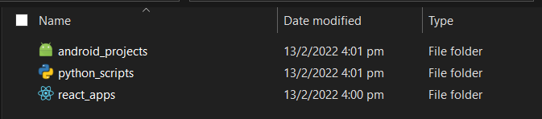

# devfolders

CLI tool to change boring folder icons to cool dev-related icons

## Installation
You can install the Devfolders CLI using npm (Node Package Manager). Note that you will need to install [Node.js](https://nodejs.org) and [npm](https://npmjs.org). Installing Node.js should install npm as well.
**Make sure to install it globally with -g**

`npm install -g devfolders`

## Usage
`$ devfolder` or `$ devfolder <options>`

Options:

| Option | Description |
| --- | ----------- |
| list | List the available folder icons|
| -v, --version | Outputs the current version of devfolder |
| -t, --target | `"sub"` or `"current"`. Specifies which directory to target|
| -i, --icon | Specifies which icon to use. See available icons below|
<!-- | remove | Undo the folder icons| -->

## Examples

Default process with prompts

`$ devfolder`

Target all sub-directories (one level deep)

`$ devfolder -t sub`

Specify folder icon

`$ devfolder -i flutter`

Set the current folder's icon

`$ devfolder -t current -i flutter`

<!-- Remove the current folder's icon

`$ devfolder remove -t current` -->

> Note: devfolder works by creating a desktop config file in the specified folder. You may want to add it to any .gitignore files
---
## Available Icons 

- [flutter](https://github.com/shawn-grant/devfolders/blob/main/icons/linux/flutter.png)
- [reactjs](https://github.com/shawn-grant/devfolders/blob/main/icons/linux/reactjs.png)
- [nodejs](https://github.com/shawn-grant/devfolders/blob/main/icons/linux/nodejs.png)
- [android](https://github.com/shawn-grant/devfolders/blob/main/icons/linux/android.png)
- [javascript](https://github.com/shawn-grant/devfolders/blob/main/icons/linux/javascript.png)
- [typescript](https://github.com/shawn-grant/devfolders/blob/main/icons/linux/typescript.png)
- [unity3d](https://github.com/shawn-grant/devfolders/blob/main/icons/linux/unity3d.png)
- [apple](https://github.com/shawn-grant/devfolders/blob/main/icons/linux/apple.png)
- [angular](https://github.com/shawn-grant/devfolders/blob/main/icons/linux/angular.png)
- [c](https://github.com/shawn-grant/devfolders/blob/main/icons/linux/c.png)
- [cpp](https://github.com/shawn-grant/devfolders/blob/main/icons/linux/cpp.png)
- [csharp](https://github.com/shawn-grant/devfolders/blob/main/icons/linux/csharp.png)
- [java](https://github.com/shawn-grant/devfolders/blob/main/icons/linux/java.png)
- [python](https://github.com/shawn-grant/devfolders/blob/main/icons/linux/python.png)
- [ruby](https://github.com/shawn-grant/devfolders/blob/main/icons/linux/ruby.png)
- [windows](https://github.com/shawn-grant/devfolders/blob/main/icons/linux/windows.png)
- [linux](https://github.com/shawn-grant/devfolders/blob/main/icons/linux/linux.png)
- [vuejs](https://github.com/shawn-grant/devfolders/blob/main/icons/linux/vuejs.png)
- [svelte](https://github.com/shawn-grant/devfolders/blob/main/icons/linux/svelte.png)
- [firebase](https://github.com/shawn-grant/devfolders/blob/main/icons/linux/firebase.png)
- [aws](https://github.com/shawn-grant/devfolders/blob/main/icons/linux/aws.png)
- [terminal](https://github.com/shawn-grant/devfolders/blob/main/icons/linux/terminal.png)

## TODO
- More icons
- Add macOS and Linux support

<!-- 
## Contributing

### adding icons: -->

